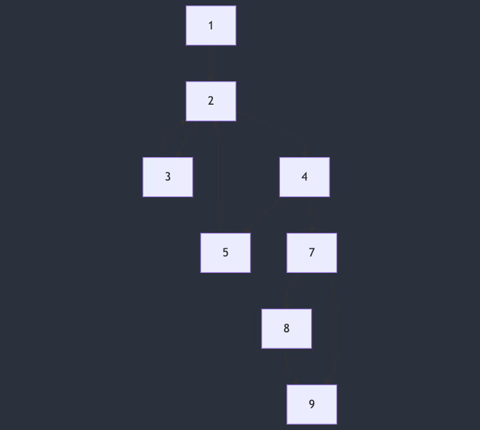

<!-- #region 1 -->
01| Problem background: how to measure the quality of software tests?
---
<!-- cmd column_layout: [1, 1] -->

<!-- #region 1.1 - snippet -->
<!-- cmd column: 0 -->
```c
#include <stdio.h>
#include <stdlib.h>
    
enum receive_return_code {
    OK,
    ERR,
    END,
}
// remember to free ;)
receive(void** data, const char* err);

void process(void* data);

void foo() {

    void* data = NULL;
    _Bool is_valid = 0;
    char* err_info = NULL;


    for (;;) {

        enum receive_return_code rc = receive(
            &data, 
            err_info
        );

        if (rc == OK) {
    
    
            is_valid = 1;
            process(data);
    
    
        } else if (rc == ERR) {
    
    
            is_valid = 0;
            printf("%s", err_info);
    
        }
    
        else break;
    
    }


    if (!is_valid) {


        free((void*)err_info);

    }


    free(data);

}
```
<!-- #endregion -->

<!-- #region 1.1 - text -->
<!-- cmd column: 1 -->
#### NOTE: BUG after 1 ERR and then 1 OK
Test cases:
- __jm__
    - send(ERR, "dns_probe_finished_nxdomain")
    - send(END)
- __jm__
    - send(OK, "HTTP: 200")
    - send(END)
<!-- #endregion -->

<!-- cmd end_slide -->
<!-- #endregion -->

<!-- #region 2 -->
02| Problem background: how to measure the quality of software tests?
---


<!-- cmd column_layout: [1, 1] -->

<!-- #region 2.1 - snippet -->
<!-- cmd column: 0 -->
```c
#include <stdio.h>
#include <stdlib.h>
    
enum receive_return_code {
    OK,
    ERR,
    END,
}
// remember to free ;)
receive(void** data, const char* err);

void process(void* data);

void foo() {
    // region 1
    void* data = NULL;
    _Bool is_valid = 0;
    char* err_info = NULL;
    // endregion

    for (;;) {
        // region 2
        enum receive_return_code rc = receive(
            &data, 
            err_info
        );

        if (rc == OK) {
        // endregion
            // region 3
            is_valid = 1;
            process(data);
            // endregion
        // region 4
        } else if (rc == ERR) {
        // endregion
            // region 5
            is_valid = 0;
            printf("%s", err_info);
            // endregion
        }
        // region 7
        else break;
    }

    if (!is_valid) {
    // endregion
        // region 8
        free((void*)err_info);
        // endregion
    }

    // region 9
    free(data);
    // endregion
}
```
<!-- #endregion -->

<!-- cmd column: 1 -->
<!-- #region 2.2.1 - text -->
#### NOTE: BUG after 1 ERR and then 1 OK
Test cases:
- __jm__
    - send(ERR, "dns_probe_finished_nxdomain")
    - send(END)
- __jm__
    - send(OK, "HTTP: 200")
    - send(END)
<!-- #endregion -->

<!-- #region 2.2.2 - CFG -->

<!-- #endregion -->

<!-- cmd reset_layout -->
# Other headers

All other header types are simply treated as headers within your slide.

## Subheaders
### And more

<!-- cmd end_slide -->

Slide commands
---

Certain commands in the form of HTML comments can be used:

# Ending slides

In order to end a single slide, use:

```html
<!-- cmd end_slide -->
```

# Creating pauses

Slides can be paused by using the `pause` command:

```html
<!-- cmd pause -->
```

This allows you to:

<!-- cmd pause -->
* Create suspense.
<!-- cmd pause -->
* Have more interactive presentations.
<!-- cmd pause -->
* Possibly more!

<!-- cmd end_slide -->

Code highlighting
---

Code highlighting is enabled for code blocks that include the most commonly used programming languages:


```rust
// Rust
fn greet() -> &'static str {
    "hi mom"
}
```

```python
# Python
def greet() -> str:
    return "hi mom"
```

```cpp
// C++
string greet() {
    return "hi mom";
}
```

And many more!

<!-- cmd end_slide -->

Dynamic code highlighting
---

Select specific subsets of lines to be highlighted dynamically as you move to the next slide. Optionally enable line
numbers to make it easier to specify which lines you're referring to!

```rust {1-4|6-10|all} +line_numbers
#[derive(Clone, Debug)]
struct Person {
    name: String,
}

impl Person {
    fn say_hello(&self) {
        println!("hello, I'm {}", self.name)
    }
}
```

<!-- cmd end_slide -->

Snippet execution
---

Code snippets can be executed:

* For various languages, including compiled ones.
* Their output is shown in real time.
* Unimportant lines can be hidden so they don't clutter what you're trying to convey.
* By default by pressing `<ctrl-e>`.

```rust +exec
# use std::thread::sleep;
# use std::time::Duration;
fn main() {
    let names = ["Alice", "Bob", "Eve", "Mallory", "Trent"];
    for name in names {
        println!("Hi {name}!");
        sleep(Duration::from_millis(500));
    }
}
```

<!-- cmd end_slide -->

Images
---

Image rendering is supported as long as you're using iterm2, your terminal supports
the kitty graphics protocol (such as the kitty terminal itself!), or the sixel format.

* Include images in your slides by using ``.
* Images will be rendered in **their original size**.
    * If they're too big they will be scaled down to fit the screen.


_Picture by Alexis Bailey / CC BY-NC 4.0_

<!-- cmd end_slide -->

Column layouts
---

<!-- cmd column_layout: [2, 1] -->

<!-- cmd column: 0 -->

Column layouts let you organize content into columns.

Here you can place code:

```rust
fn potato() -> u32 {
    42
}
```

Plus pretty much anything else:
* Bullet points.
* Images.
* _more_!

<!-- cmd column: 1 -->


_Picture by Alexis Bailey / CC BY-NC 4.0_

<!-- cmd reset_layout -->

Because we just reset the layout, this text is now below both of the columns. Code and any other element will now look
like it usually does:

```python
print("Hello world!")
```

<!-- cmd end_slide -->

Text formatting
---

Text formatting works as expected:

* **This is bold text**.
* _This is italics_.
* **This is bold _and this is bold and italic_**.
* ~This is strikethrough text.~
* Inline code `is also supported`.
* Links look like this [](https://example.com/)

<!-- cmd end_slide -->

Other elements
---

Other elements supported are:

# Tables

| Name | Taste |
| ------ | ------ |
| Potato | Great |
| Carrot | Yuck |

# Block quotes

> Lorem ipsum dolor sit amet. Eos laudantium animi ut ipsam beataeet
> et exercitationem deleniti et quia maiores a cumque enim et
> aspernatur nesciunt sed adipisci quis.

# Thematic breaks

A horizontal line by using `---`.

---