<!-- #region 2 -->

# 01| Problem background: how to measure the quality of software tests?

<!-- cmd column_layout: [1, 1, 1] -->

<!-- cmd column: 0 -->
<!-- #region 2.0 - snippet -->

```c
char foo(char a, char b) {

    char* p = NULL;
    char result = 0;
    if (a == 0) {

        p = &b;
    }
    if (b == 0) {
        result = *p;
    } else {
        result = b;
    }

    return result;
}


```

<!-- #endregion -->

<!-- cmd column: 2 -->
<!-- #region 2.2 - text -->

# Test cases:

#### a == 0, b == 0;

#### a == 1, b == 1;

<!-- #endregion -->

<!-- #endregion -->
<!-- cmd end_slide -->

<!-- #region 3 -->

# 02| Problem background: how to measure the quality of software tests?

<!-- cmd column_layout: [1, 1, 1] -->

<!-- cmd column: 0 -->
<!-- #region 3.0 - snippet -->

```c
char foo(char a, char b) {
    // region 1
    char* p = NULL;
    char result = 0;
    if (a == 0) {
    // endregion
        p = &b; // region 2
    }
    if (b == 0) { // region 3
        result = *p; // region 4
    } else {
        result = b; // region 5
    }

    return result; // region 6
}


```

<!-- #endregion -->

<!-- cmd column: 1 -->
<!-- #region 3.1 - CFG -->

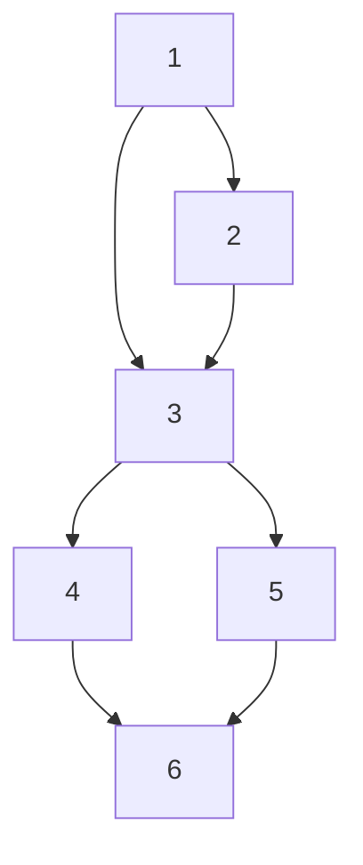

<!-- #endregion -->

<!-- cmd column: 2 -->
<!-- #region 3.2 - text -->

# Test cases:

#### a == 0, b == 0;

#### a == 1, b == 1;

<!-- #endregion -->

<!-- #endregion -->
<!-- cmd end_slide -->

<!-- #region 4 -->

# 03| Coverage criteria 1: Node coverage

<!-- cmd column_layout: [1, 1, 1] -->

<!-- cmd column: 0 -->
<!-- #region 4.0 - snippet -->

```c
char foo(char a, char b) {
    // region 1
    char* p = NULL;
    char result = 0;
    if (a == 0) {
    // endregion
        p = &b; // region 2
    }
    if (b == 0) { // region 3
        result = *p; // region 4
    } else {
        result = b; // region 5
    }

    return result; // region 6
}


```

<!-- #endregion -->

<!-- cmd column: 1 -->
<!-- #region 4.1 - CFG -->


<!-- #endregion -->

<!-- cmd column: 2 -->
<!-- #region 4.2 - text -->

# Test cases:

#### a == 0, b == 0;

#### a == 1, b == 1;

# Node Coverage

<!-- #endregion -->

<!-- #endregion -->
<!-- cmd end_slide -->

<!-- #region 5 -->

# 04| Coverage criteria 1: Node coverage

<!-- cmd column_layout: [1, 1, 1] -->

<!-- cmd column: 0 -->
<!-- #region 5.0 - snippet -->

```c
char foo(char a, char b) {
    // region 1
    char* p = NULL;
    char result = 0;
    if (a == 0) {
    // endregion
        p = &b; // region 2
    }
    if (b == 0) { // region 3
        result = *p; // region 4
    } else {
        result = b; // region 5
    }

    return result; // region 6
}


```

<!-- #endregion -->

<!-- cmd column: 1 -->
<!-- #region 5.1 - CFG -->

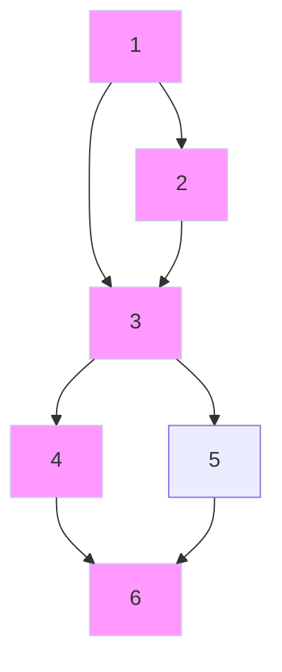

<!-- #endregion -->

<!-- cmd column: 2 -->
<!-- #region 5.2 - text -->

# Test cases:

## a == 0, b == 0;

#### a == 1, b == 1;

# Node Coverage

<!-- #endregion -->

<!-- #endregion -->
<!-- cmd end_slide -->

<!-- #region 6 -->

# 05| Coverage criteria 1: Node coverage

<!-- cmd column_layout: [1, 1, 1] -->

<!-- cmd column: 0 -->
<!-- #region 6.0 - snippet -->

```c
char foo(char a, char b) {
    // region 1
    char* p = NULL;
    char result = 0;
    if (a == 0) {
    // endregion
        p = &b; // region 2
    }
    if (b == 0) { // region 3
        result = *p; // region 4
    } else {
        result = b; // region 5
    }

    return result; // region 6
}


```

<!-- #endregion -->

<!-- cmd column: 1 -->
<!-- #region 6.1 - CFG -->

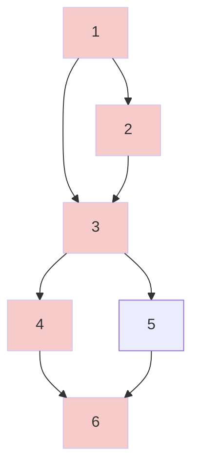

<!-- #endregion -->

<!-- cmd column: 2 -->
<!-- #region 6.2 - text -->

# Test cases:

### a == 0, b == 0;

#### a == 1, b == 1;

# Node Coverage

<!-- #endregion -->

<!-- #endregion -->
<!-- cmd end_slide -->

<!-- #region 7 -->

# 06| Coverage criteria 1: Node coverage

<!-- cmd column_layout: [1, 1, 1] -->

<!-- cmd column: 0 -->
<!-- #region 7.0 - snippet -->

```c
char foo(char a, char b) {
    // region 1
    char* p = NULL;
    char result = 0;
    if (a == 0) {
    // endregion
        p = &b; // region 2
    }
    if (b == 0) { // region 3
        result = *p; // region 4
    } else {
        result = b; // region 5
    }

    return result; // region 6
}


```

<!-- #endregion -->

<!-- cmd column: 1 -->
<!-- #region 7.1 - CFG -->

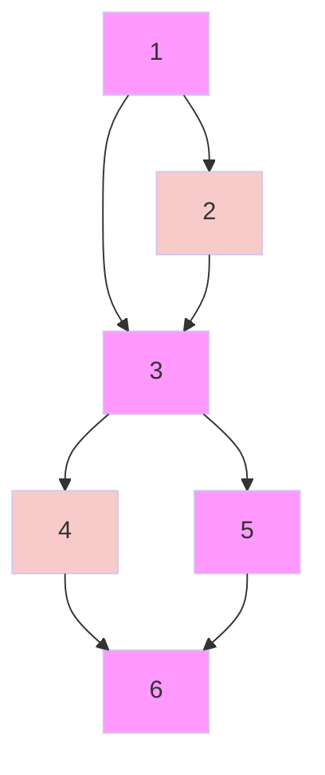

<!-- #endregion -->

<!-- cmd column: 2 -->
<!-- #region 7.2 - text -->

# Test cases:

### a == 0, b == 0;

## a == 1, b == 1;

# Node Coverage

<!-- #endregion -->

<!-- #endregion -->
<!-- cmd end_slide -->

<!-- #region 8 -->

# 07| Coverage criteria 1: Node coverage

<!-- cmd column_layout: [1, 1, 1] -->

<!-- cmd column: 0 -->
<!-- #region 8.0 - snippet -->

```c
char foo(char a, char b) {
    // region 1
    char* p = NULL;
    char result = 0;
    if (a == 0) {
    // endregion
        p = &b; // region 2
    }
    if (b == 0) { // region 3
        result = *p; // region 4
    } else {
        result = b; // region 5
    }

    return result; // region 6
}


```

<!-- #endregion -->

<!-- cmd column: 1 -->
<!-- #region 8.1 - CFG -->

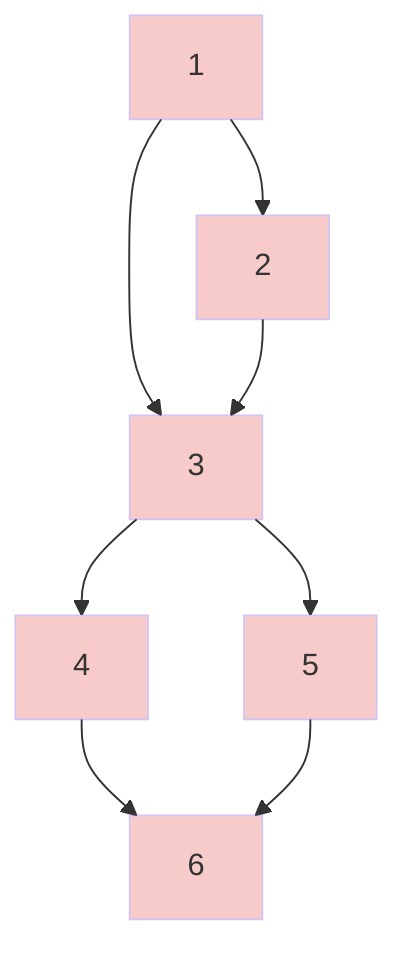

<!-- #endregion -->

<!-- cmd column: 2 -->
<!-- #region 8.2 - text -->

# Test cases:

### a == 0, b == 0;

### a == 1, b == 1;

# Node Coverage

# Coverage is 100%

<!-- #endregion -->

<!-- #endregion -->
<!-- cmd end_slide -->

<!-- #region 9 -->

# 08| Coverage criteria 2: Edge coverage

<!-- cmd column_layout: [1, 1, 1] -->

<!-- cmd column: 0 -->
<!-- #region 9.0 - snippet -->

```c
char foo(char a, char b) {
    // region 1
    char* p = NULL;
    char result = 0;
    if (a == 0) {
    // endregion
        p = &b; // region 2
    }
    if (b == 0) { // region 3
        result = *p; // region 4
    } else {
        result = b; // region 5
    }

    return result; // region 6
}


```

<!-- #endregion -->

<!-- cmd column: 1 -->
<!-- #region 9.1 - CFG -->


<!-- #endregion -->

<!-- cmd column: 2 -->
<!-- #region 9.2 - text -->

# Test cases:

#### a == 0, b == 0;

#### a == 1, b == 1;

# Edge Coverage

<!-- #endregion -->

<!-- #endregion -->
<!-- cmd end_slide -->

<!-- #region 10 -->

# 09| Coverage criteria 2: Edge coverage

<!-- cmd column_layout: [1, 1, 1] -->

<!-- cmd column: 0 -->
<!-- #region 10.0 - snippet -->

```c
char foo(char a, char b) {
    // region 1
    char* p = NULL;
    char result = 0;
    if (a == 0) {
    // endregion
        p = &b; // region 2
    }
    if (b == 0) { // region 3
        result = *p; // region 4
    } else {
        result = b; // region 5
    }

    return result; // region 6
}


```

<!-- #endregion -->

<!-- cmd column: 1 -->
<!-- #region 10.1 - CFG -->

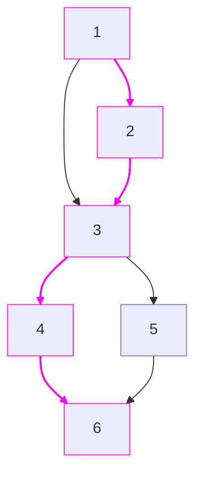

<!-- #endregion -->

<!-- cmd column: 2 -->
<!-- #region 10.2 - text -->

# Test cases:

## a == 0, b == 0;

#### a == 1, b == 1;

# Edge Coverage

<!-- #endregion -->

<!-- #endregion -->
<!-- cmd end_slide -->

<!-- #region 11 -->

# 10| Coverage criteria 2: Edge coverage

<!-- cmd column_layout: [1, 1, 1] -->

<!-- cmd column: 0 -->
<!-- #region 11.0 - snippet -->

```c
char foo(char a, char b) {
    // region 1
    char* p = NULL;
    char result = 0;
    if (a == 0) {
    // endregion
        p = &b; // region 2
    }
    if (b == 0) { // region 3
        result = *p; // region 4
    } else {
        result = b; // region 5
    }

    return result; // region 6
}


```

<!-- #endregion -->

<!-- cmd column: 1 -->
<!-- #region 11.1 - CFG -->

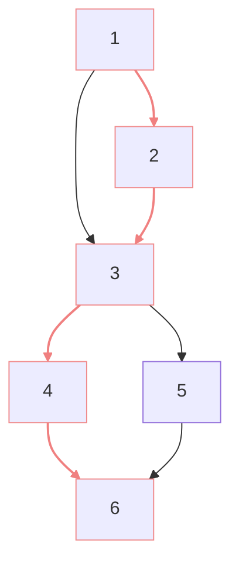

<!-- #endregion -->

<!-- cmd column: 2 -->
<!-- #region 11.2 - text -->

# Test cases:

### a == 0, b == 0;

#### a == 1, b == 1;

# Edge Coverage

<!-- #endregion -->

<!-- #endregion -->
<!-- cmd end_slide -->

<!-- #region 12 -->

# 11| Coverage criteria 2: Edge coverage

<!-- cmd column_layout: [1, 1, 1] -->

<!-- cmd column: 0 -->
<!-- #region 12.0 - snippet -->

```c
char foo(char a, char b) {
    // region 1
    char* p = NULL;
    char result = 0;
    if (a == 0) {
    // endregion
        p = &b; // region 2
    }
    if (b == 0) { // region 3
        result = *p; // region 4
    } else {
        result = b; // region 5
    }

    return result; // region 6
}


```

<!-- #endregion -->

<!-- cmd column: 1 -->
<!-- #region 12.1 - CFG -->

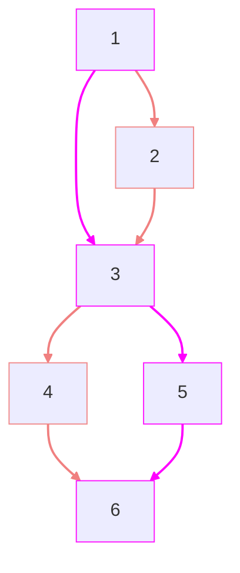

<!-- #endregion -->

<!-- cmd column: 2 -->
<!-- #region 12.2 - text -->

# Test cases:

### a == 0, b == 0;

## a == 1, b == 1;

# Edge Coverage

<!-- #endregion -->

<!-- #endregion -->
<!-- cmd end_slide -->

<!-- #region 13 -->

# 12| Coverage criteria 2: Edge coverage

<!-- cmd column_layout: [1, 1, 1] -->

<!-- cmd column: 0 -->
<!-- #region 13.0 - snippet -->

```c
char foo(char a, char b) {
    // region 1
    char* p = NULL;
    char result = 0;
    if (a == 0) {
    // endregion
        p = &b; // region 2
    }
    if (b == 0) { // region 3
        result = *p; // region 4
    } else {
        result = b; // region 5
    }

    return result; // region 6
}


```

<!-- #endregion -->

<!-- cmd column: 1 -->
<!-- #region 13.1 - CFG -->

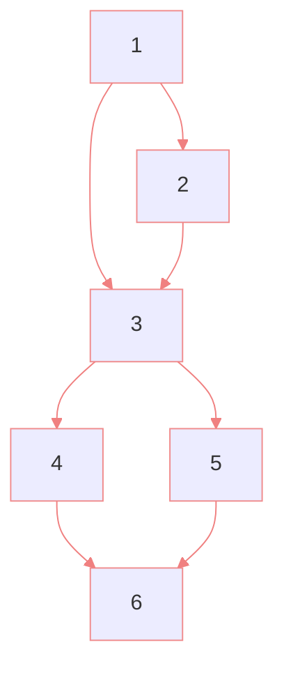

<!-- #endregion -->

<!-- cmd column: 2 -->
<!-- #region 13.2 - text -->

# Test cases:

### a == 0, b == 0;

### a == 1, b == 1;

# Edge Cover

# Coverage is 100%

<!-- #endregion -->

<!-- #endregion -->
<!-- cmd end_slide -->

<!-- #region 14 -->

# 13| Other coverage criteria

<!-- cmd column_layout: [1, 1, 1] -->

<!-- cmd column: 0 -->
<!-- #region 14.0 - snippet -->

```c
char foo(char a, char b) {
    // region 1
    char* p = NULL;
    char result = 0;
    if (a == 0) {
    // endregion
        p = &b; // region 2
    }
    if (b == 0) { // region 3
        result = *p; // region 4
    } else {
        result = b; // region 5
    }

    return result; // region 6
}


```

<!-- #endregion -->

<!-- cmd column: 1 -->
<!-- #region 14.1 - CFG -->


<!-- #endregion -->

<!-- cmd column: 2 -->
<!-- #region 14.2 - text -->

# Test cases:

#### a == 0, b == 0;

#### a == 1, b == 1;

# Other criteria:

## Edge pair coverage

All paths of length at most 2 must be covered

## All paths coverage

Only applicable with DAG CFG's, otherwise there are infinitely many paths

## Prime paths coverage

All maximal, simple paths and all simple cycles must be covered

## all-defs coverage

For all defs of some x, any path, without redefinitions, to some use of that x is covered

## all-uses coverage

For all defs of some x, all paths, without redefinitions, to any use of that x, are covered

<!-- #endregion -->

<!-- #endregion -->
<!-- cmd end_slide -->

<!-- #region 15 -->

# 14| Coverage criteria 3: all-du-paths coverage

<!-- cmd column_layout: [1, 1, 1] -->

<!-- cmd column: 0 -->
<!-- #region 16.0 - snippet -->

```c
char foo(char a, char b) {
    // region 1 - def(p)
    char* p = NULL;
    char result = 0;
    if (a == 0) {
    // endregion
        p = &b; // region 2 - def(p)
    }
    if (b == 0) { // region 3
        result = *p; // region 4 - use(p)
    } else {
        result = b; // region 5
    }

    return result; // region 6
}


```

<!-- #endregion -->

<!-- cmd column: 1 -->
<!-- #region 15.1 - CFG -->

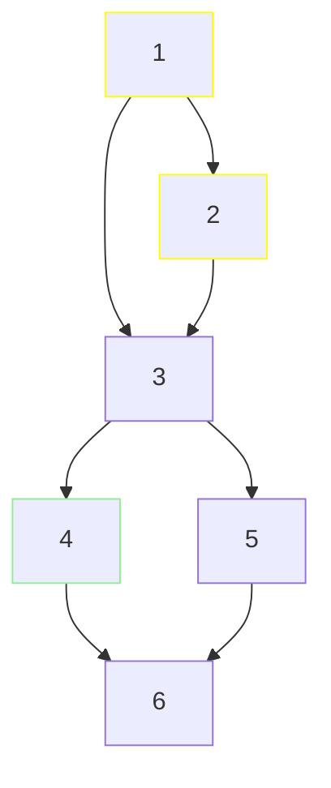

<!-- #endregion -->

<!-- cmd column: 2 -->
<!-- #region 15.2 - text -->

# Test cases:

#### a == 0, b == 0;

#### a == 1, b == 1;

# all-du-paths Cover

## def-use paths for _p_:

#### [1,3,4]

#### [2,3,4]

<!-- #endregion -->

<!-- #endregion -->
<!-- cmd end_slide -->

<!-- #region 16 -->

# 15| Coverage criteria 3: all-du-paths coverage

<!-- cmd column_layout: [1, 1, 1] -->

<!-- cmd column: 0 -->
<!-- #region 16.0 - snippet -->

```c
char foo(char a, char b) {
    // region 1 - def(p)
    char* p = NULL;
    char result = 0;
    if (a == 0) {
    // endregion
        p = &b; // region 2 - def(p)
    }
    if (b == 0) { // region 3
        result = *p; // region 4 - use(p)
    } else {
        result = b; // region 5
    }

    return result; // region 6
}


```

<!-- #endregion -->

<!-- cmd column: 1 -->
<!-- #region 16.1 - CFG -->

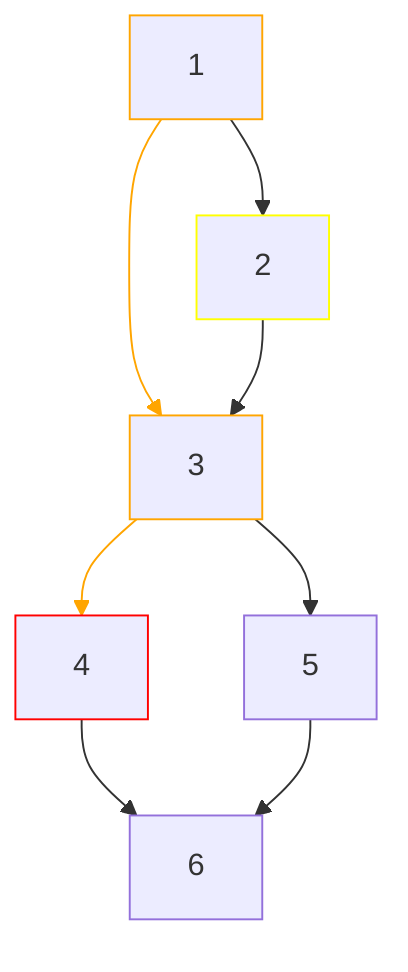

<!-- #endregion -->

<!-- cmd column: 2 -->
<!-- #region 16.2 - text -->

# Test cases:

#### a == 0, b == 0;

#### a == 1, b == 1;

# all-du-paths Cover

## def-use paths for _p_:

#### [1,3,4] - finds the NPE!

#### [2,3,4]

<!-- #endregion -->

<!-- #endregion -->
<!-- cmd end_slide -->

<!-- #region 17 -->

# 16| Coverage criteria 3: all-du-paths coverage

<!-- cmd column_layout: [1, 1, 1] -->

<!-- cmd column: 0 -->
<!-- #region 17.0 - snippet -->

```c
char foo(char a, char b) {
    // region 1 - def(b)
    char* p = NULL;
    char result = 0;
    if (a == 0) {
    // endregion
        p = &b; // region 2 - use(b)
    }
    if (b == 0) { // region 3 - use(b)
        result = *p; // region 4
    } else {
        result = b; // region 5 - use(b)
    }

    return result; // region 6
}


```

<!-- #endregion -->

<!-- cmd column: 1 -->
<!-- #region 17.1 - CFG -->

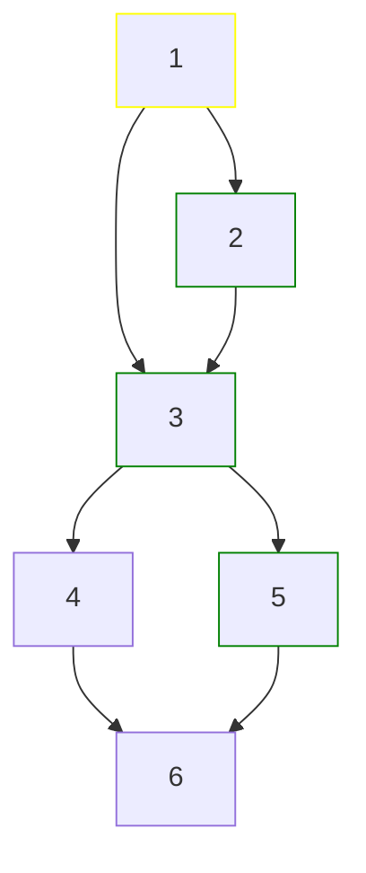

<!-- #endregion -->

<!-- cmd column: 2 -->
<!-- #region 17.2 - text -->

# Test cases:

#### a == 0, b == 0;

#### a == 1, b == 1;

# all-du-paths Cover

## def-use paths for _p_:

#### [1,3,4] - finds the NPE!

#### [2,3,4]

# It may not always be obvious what scope to choose to find bugs, and including too many variables can result in path explosion.

# def-use paths for _b_:

<!-- char foo(char a, char b) {
    // region 1 - def(b)
    char* p = NULL;
    char result = 0;
    if (a == 0) {
    // endregion
        p = &b; // region 2 - use(b)
    }
    if (b == 0) { // region 3 - use(b)
        result = *p; // region 4
    } else {
        result = b; // region 5 - use(b)
    }

    return result; // region 6
} -->

#### [1,2]

#### [1,2,3]

#### [1,2,3,5]

#### [1,3]

#### [1,3,5]

<!-- #endregion -->

<!-- #endregion -->
<!-- cmd end_slide -->

<!-- #region 18 -->

# 17| Coverage criteria 3: all-du-paths coverage

<!-- cmd column_layout: [1, 1, 1] -->

<!-- cmd column: 0 -->
<!-- #region 18.0 - snippet -->

```c
char foo(char a, char b) {
    // region 1 - def(b)
    char* p = NULL;
    char result = 0;
    if (a == 0) {
    // endregion
        p = &b; // region 2 - use(b)
    }
    if (b == 0) { // region 3 - use(b)
        result = *p; // region 4
    } else {
        result = b; // region 5 - use(b)
    }

    return result; // region 6
}


```

<!-- #endregion -->

<!-- cmd column: 1 -->
<!-- #region 18.1 - CFG -->


<!-- #endregion -->

<!-- cmd column: 2 -->
<!-- #region 18.2 - text -->

# Test cases:

#### a == 0, b == 0;

#### a == 1, b == 1;

# all-du-paths Cover

## def-use paths for _p_:

#### [1,3,4] - finds the NPE!

#### [2,3,4]

# It may not always be obvious what scope to choose to find bugs, and including too many variables can result in path explosion.

# def-use paths for _b_:

<!-- char foo(char a, char b) {
    // region 1 - def(b)
    char* p = NULL;
    char result = 0;
    if (a == 0) {
    // endregion
        p = &b; // region 2 - use(b)
    }
    if (b == 0) { // region 3 - use(b)
        result = *p; // region 4
    } else {
        result = b; // region 5 - use(b)
    }

    return result; // region 6
} -->

#### ~~[1,2]~~

#### ~~[1,2,3]~~

## [1,2,3,5]

#### ~~[1,3]~~

## [1,3,5]

# There are redundancies we can leverage to cover more paths with less work - this is the main focus of the project

<!-- #endregion -->

<!-- #endregion -->
<!-- cmd end_slide -->

<!-- #region 19 -->

Problems to address:
---
<!-- cmd column_layout: [3, 2] -->
<!-- cmd column: 0 -->
- The algorithm
  - Is it possible to stream path generation without storing all paths? How lazy can it get?
  - Long paths are quick to compare _(len(p1) - len(p2) 'characters')_
  - Shorter paths hint at many techniques used in pattern searching

- Variable aliasing
  - A general problem of data-flow coverage
  - Does the use of a pointer also constitute the use of a potential pointee?
```c
    if (condition) {
        p = &b; // def(p), use(b)
    }
    ...
    printf("%s", *p); // is this a use(b)?
```

- Cycles
  - No clear-cut approach in the literature, according to various sources:
  - Include all simple cycles
  - Include all simple cycles containing a def
  - Include all du-paths with all possible simple-cycle detours (finite)

- Tooling is not well-developed
<!-- cmd column: 1 -->
```c
void foo() {
    void* data = NULL;
    _Bool is_valid = 0;
    char* err_info = NULL;

    for (;;) {
        enum receive_return_code rc = receive(
            &data, 
            err_info
        );
        if (rc == OK) {
            is_valid = 1;
            process(data);
        } else if (rc == ERR) {
            is_valid = 0;
            printf("%s", err_info);
        }
        else break;    
    }

    if (!is_valid) {
        free((void*)err_info);
    }
    free(data);
}
```
<!-- #endregion -->